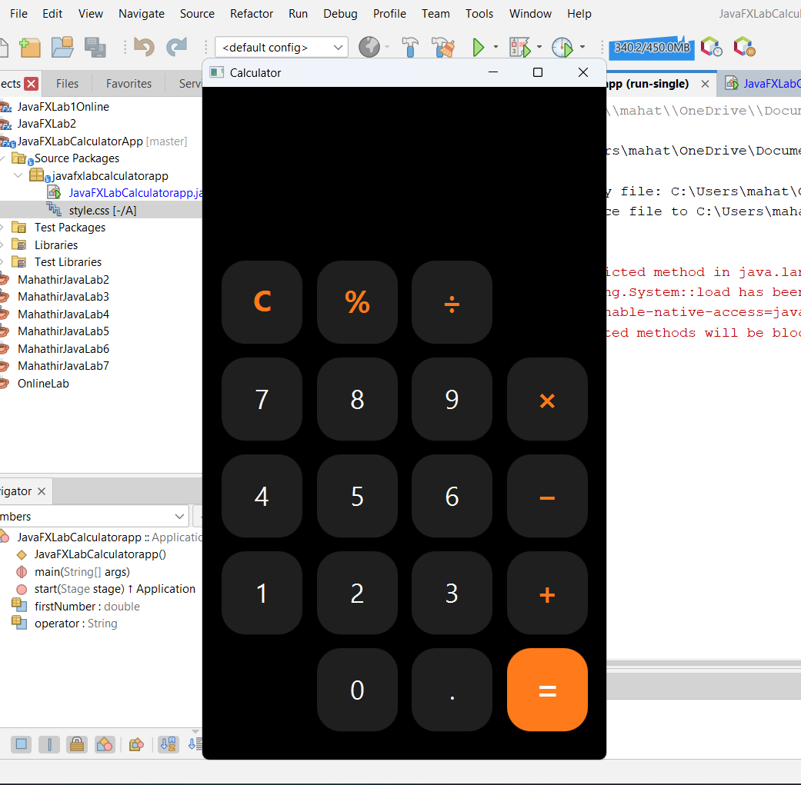

# 🧮 JavaFX Calculator

A simple and interactive calculator application developed using JavaFX.  
This project performs basic arithmetic operations such as addition, subtraction, multiplication, and division through a clean and user-friendly graphical interface.

---

## 📸 Screenshot

---

## ✨ Features

➕ Addition  
➖ Subtraction  
✖️ Multiplication  
➗ Division  
🔄 Clear input option  
📟 Real-time result display  

---

## 🛠️ Technologies Used

- Java  
- JavaFX  

---

## 🖥️ UI Components

- Stage – Main application window  
- Scene – UI container  
- GridPane – Layout management system  
- Button – User interaction controls  
- TextField – Display screen for input/output  

---

## ⚙️ How It Works

This calculator is built using event-driven programming.

- Each button click triggers an event  
- Input is processed instantly  
- Result is updated in real-time on the display  

---

## 🎯 Objective

This project helps to understand:

- JavaFX GUI development  
- Event-driven programming concepts  
- Basic application structure  
- Logical problem solving in UI applications  

---

## 🚀 Future Improvements

- Scientific calculator features  
- Keyboard input support  
- Improved UI/UX design  
- Error handling (e.g., divide by zero protection)  

---

## 📌 Author

**Mahathir Mohammad**